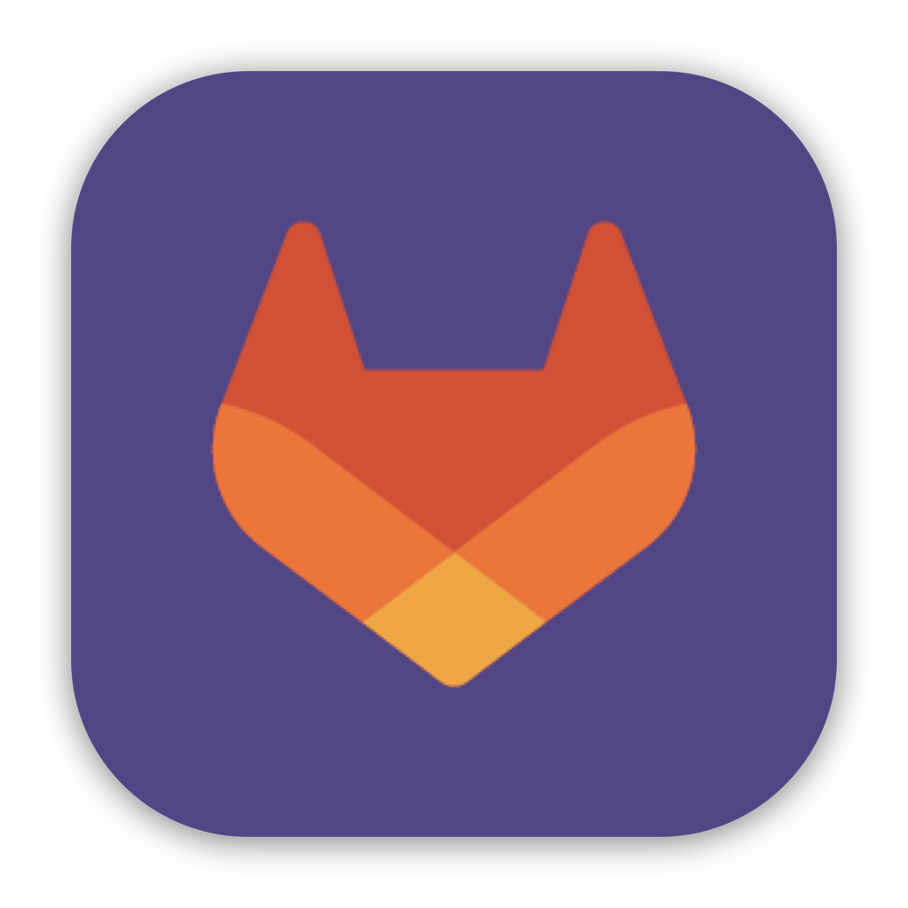
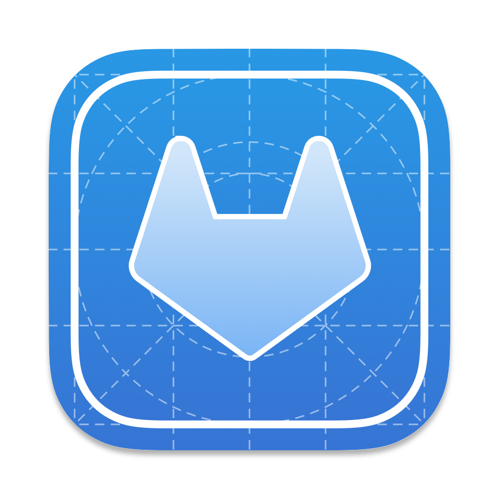

  
  
  <h1 align="center">GitLab Widget</h1>

 is a menu bar application that makes it easier to work with GitLab. The Widget makes it easy to see the merge requests you opened and the merge requests your should review. It will also notify you when any of your merge requests get approved.

#### Supported Platforms

  
  
  
  
  

## Feature Ideas
- [ ] Button + shortcut copy text + MR name for slack
- [x] Right click menu
- [ ] Notifications for comments
- [ ] Click on job to open job url
- [ ] See comments since last view
- [ ] MR Activity view
- [ ] Settings menu
- [ ] Switch between app / menubar view
- [ ] Choose Icon in menubar
- [ ] Choose Icon in dock
- [ ] Show information in menubar icon (notifications/unreads ect)
- [ ] Open MR of recently pushed branch
- [ ] Recent projects buttons
