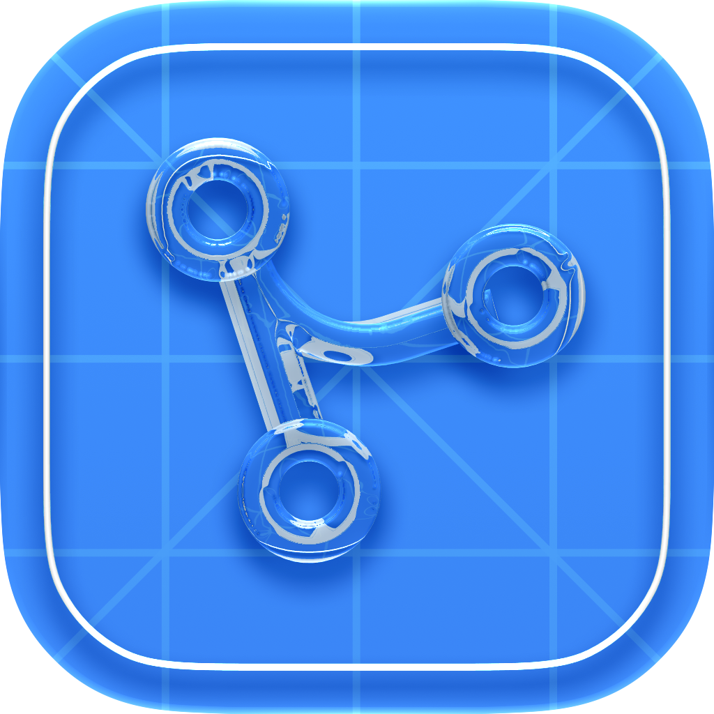
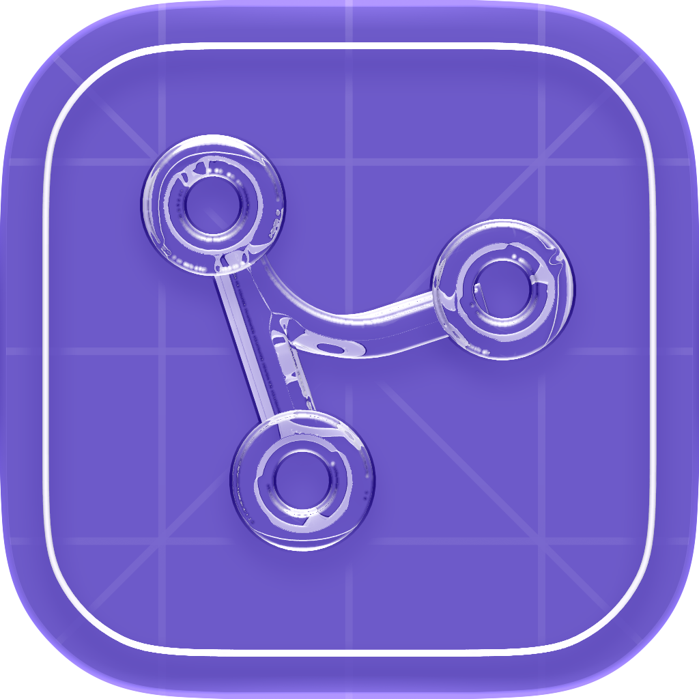
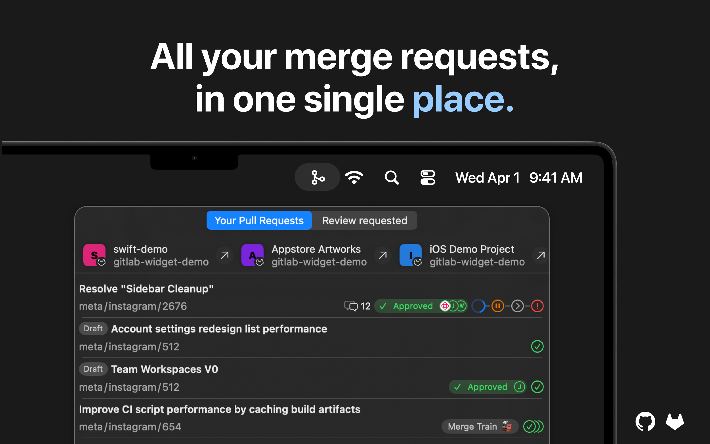
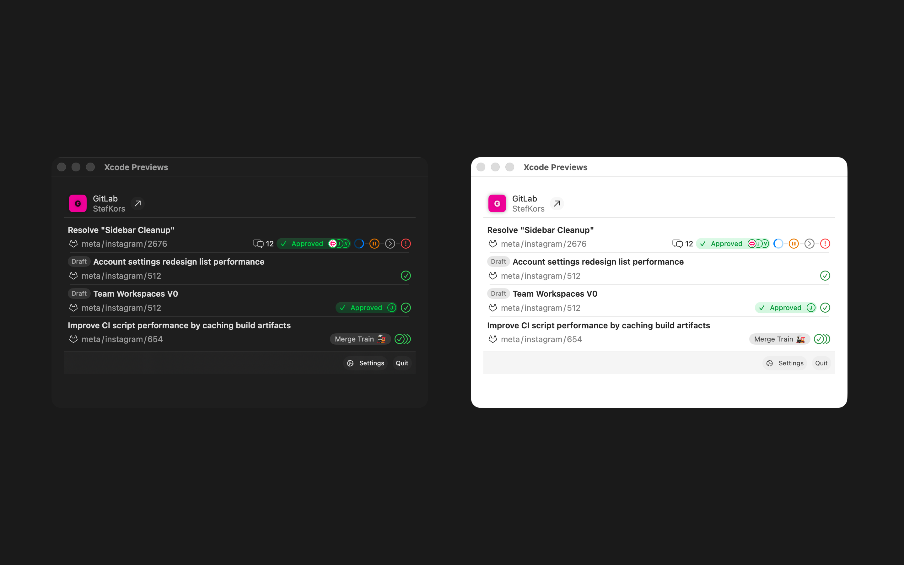

<p align="center">
  
  
  
  <h1 align="center">Merger for GitLab and GitHub</h1>
</p>

[Merger](https://github.com/StefKors/GitLab) brings all your GitLab and GitHub merge requests together in one handy menu bar app. It keeps track of what you have opened, what is waiting for your review, and rings a little bell when one of your merge requests gets its well-earned approval.

#### Supported Platforms
<p align="left">
<picture>
  <source media="(prefers-color-scheme: dark)" srcset="Images/macos.svg">
  <source media="(prefers-color-scheme: light)" srcset="Images/macos-active.svg">
  
</picture>

<picture>
  <source media="(prefers-color-scheme: dark)" srcset="Images/ios-active.svg">
  <source media="(prefers-color-scheme: light)" srcset="Images/ios.svg">
  
</picture>

<picture>
  <source media="(prefers-color-scheme: dark)" srcset="Images/ipados-active.svg">
  <source media="(prefers-color-scheme: light)" srcset="Images/ipados.svg">
  
</picture>

<picture>
  <source media="(prefers-color-scheme: dark)" srcset="Images/tvos-active.svg">
  <source media="(prefers-color-scheme: light)" srcset="Images/tvos.svg">
  
</picture>

<picture>
  <source media="(prefers-color-scheme: dark)" srcset="Images/watchos-active.svg">
  <source media="(prefers-color-scheme: light)" srcset="Images/watchos.svg">
  
</picture>
</p>

-------
  
  
This repository contains **Merger**, (also known as GitLab Widget, Merge Requeest for Gitlab) a macOS menu bar widget that shows your latest merge/pull request activity.   
  
I started this project in 2021 while working at Beam. At the time, our team, like much of the developer community, was frustrated with GitLab’s merge request overview. It was slow, frequently showed stale data, and somehow simply refreshing the page did not update the information. Workarounds such as hard refreshes and clearing the browser cache were the only reliable ways to get up-to-date data. Beyond performance issues, GitLab lacked a clear personal view. Developers couldn’t easily see the merge requests they owned or needed to review, and had to dig through multiple pages to determine the status of their work. My goal was to design and build an application end-to-end that provided developers **a live overview of GitLab merge requests without opening the browser**.  

The application intended to: 

* Provide a live overview of merge requests  
* Update automatically without user interaction  
* Work entirely locally without requiring a backend server  
* Remain fast even with many merge requests  
* Present a large amount of information in a compact interface  
  
## The Xcode Project  
  
The project contains:**
**  
- 1 target for macOS  
- 1 target for macOS Widget  
- 1 target for notification content  
- 1 target for iOS (unused)  
  
Notable Dependencies:  
- SQLiteData for persistence layer built on top of GRDB  
- Nuke for AsyncImage loading and caching  
  
## Architecture  
  
Here is a quick overview of the most important folders, and brief explanation of their use:  
  
- **[Views]** for rendering the data in small reactive views  
- **[SQLiteData]** has the models persisted in SQLite  
- **[Models]** non persisted classes and structs + networkmanager  
- **[Icons]** Custom SwiftUI icon components for CI/CD status indicators  
- **[Button Styles]** Reusable SwiftUI button styles and components  
- **[NotificationContent]**  Rich notification extension with interactive UI  
  
## The Good Parts  
  
### UserInterface.swift

The main ```UserInterface.swift``` view holds all the logic. Everything below it is responsible only for rendering data.   
  
The main view:  
1. Runs a timer that controls API polling.  
2. Fetches updated data through ```NetworkManager```.  
3. Stores the results in SQLite.  
4. Uses property wrappers to reactively render persisted data.  
  
This has the added perk of keeping the UI layer simple!  
  
Over the years I spent quite some time making sure the app is performant without introducing complexity and creating unmaintainable code. With that in mind, the architecture is oriented towards batching requests together and keeping the application idle as much as possible.   
  
During that process, I experimented with Apple's Background Scheduler to move the API calls and timer to it's own background XPC Service. However, as a background service it was getting throttled too much which resulted in the UI would ending up stale. Running it as a separate XPC service also provided little benefit because the memory and energy footprint remained similar, just distributed across multiple processes. So while it was a fun profiling exercise, I couldn’t justify the added complexity.  
  
### NetworkManager 
  
The GitLab and GitHub network managers follow largely the same methods while internally handling the platform specific differences. I used the ```Get package``` to simplify HTTP code, but I decided against adding a full GraphQL framework. Instead, I manually construct GraphQL requests. This keeps dependencies smaller while still providing everything needed for the APIs.  
  
  
### UniversalMergeRequest.swift  
  
Over time, the app needed to support both GitLab merge requests and GitHub pull requests, but the UI and database layer couldn't handle two different data models without massive code duplication. I solved this by having a unified data model that could handle both GitLab MRs and GitHub PRs while maintaining type safety and enabling shared UI components and database operations.

I designed ```UniversalMergeRequest.swift``` as a unified model with:  

* Provider-specific storage using GRDB's ```@Column``` coding strategies  
* Enum-based switching ```GitProvider``` to handle different API response structures  
* Computed properties to provide a consistent interface regardless of provider  
* Transformation logic in custom initializers to normalize disparate API responses  
  
### PipelineView.swift 
  
The ```PipelineView.swift``` is one of the more interesting UI components (maybe even my favorite?). CI pipelines can contain a lot of information, but the amount of detail users need depends heavily on context. That means, for example, that when everything succeeds, the pipeline operates as a small visual indicator but when something fails, the interface becomes a tool to provide actionable information.    

  In more detail, the view:  
  
  * Shows pipeline stages and their status.  
  * Expands a stage to show individual jobs when clicked.  
  * Collapses successful pipelines to reduce visual noise.  
  * Highlights failed stages by exposing more details.
    
  
### MainContentView
  
MainContentView contains previews showcasing the different states and UI elements visible in merge request rows.  
This was useful for iterating on information hierarchy and ensuring the interface remained understandable across different states.  
  
  

  
## Some Thoughts on Design  
  
The biggest product challenge was **information density**. Merge requests have an astonishing number of possible states and statuses ([see](https://gitlab.com/gitlab-org/gitlab/-/work_items/299193)). Attempting to organise all of this information based **primarily on activity state** can quickly become overwhelming. I instead chose to organise by **ownership role**, as I noticed that developers frequently describe MRs **relationally**, for example "my MRs," "MRs I created," "MRs I authored," "MRs I'm assigned to," and "MRs I need to review”.  
  
Based on conversations with colleagues and my own experience, it additionally became clear that developers prioritised **visibility** and **findability**. They needed to understand the status of dozens of merge requests quickly rather than reading through pages of detailed information.  
  
I deliberately constrained each row to roughly two lines of information with only the most important information shown immediately:  

* merge request title  
* CI status  
* review status  
  
Everything else appears progressively through interaction.  
  
In general, a user only needs detailed CI information when something has failed. When everything succeeds, detailed information can become visual noise. I intentionally collapse successful stages to leave room for more important actionable information like approval or comment count.  
  
For example:  
* Successful pipelines collapsed because they no longer require any action for the user  
* Failed pipelines automatically expanded to expose useful details  
* Approval avatars appeared once someone had reviewed the change  
* Less relevant information disappeared once it was no longer actionable  
  
## Evolution  
  
### Abandoning  SwiftData  
The original version of the app was built using SwiftData. Unfortunately, it proved unreliable for this use case. The biggest issue was during upserts: SwiftData would initially create duplicate records and only reconcile them after approximately a second. This made synchronization unpredictable.  
Rather than continuing to work around framework limitations, I replaced SwiftData completely with SQLite. Switching to SQLiteData, built on top of GRDB, solved these issues.  
  
The tradeoff was increased maintenance because I now owned more of the persistence layer, but it provided: 

* Complete control over synchronization  
* Predictable behavior  
* Significantly improved reliability
  
It reinforced an important engineering lesson: sometimes the right decision is abandoning a promising technology when it does not fit the problem.  

  
## Closing Thoughts  
I started this project in 2021 after learning SwiftUI at Beam. The team used the widget internally on a daily basis, and after Beam shut down, I decided to publish it on the App Store.  
It has been really fun to work on over the years. Beyond the technical challenges, it taught me how to balance simplicity, maintainability, and user experience. One of the biggest lessons has been learning to optimize interfaces around the information users actually need, rather than exposing everything an API provides.  
It has been fun seeing people discover the app and get a few downloads every week. I am curious to see whether adding GitHub support increases adoption, since GitHub is used by a much larger developer community.  
A future feature I would love to add is OAuth-based authentication instead of requiring users to manually create API tokens. It would provide a much smoother onboarding experience.  

-------


Built by [Stef Kors](https://stefkors.com)


-------
